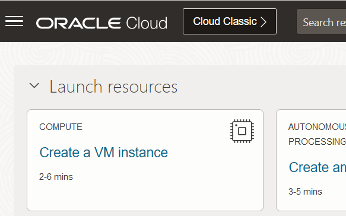

# Setup the compute instance

## Steps

### Create Compute instance on OCI

   Create a new compute instance on OCI. All following descriptions are based on `Oracle Linux 8` which is the current default compute VM image.

   

   Once the compute VM is provisioned, copy its the public IP address.

### Install required software components

   Establish an SSH connection to your newly created compute VM using a client of your choice (PuTTY, MobaXterm, ...).

   Login as user `opc` (which has sudo permissions).

   Note: Steps 3 and 4 are only required for Oracle Database version 23.4, which does not include `GDAL` in the `$ORACLE_HOME/md`.

1. Install Podman

   ```sh
   # Switch to root
   sudo su -

   # Install Podman via Container tools
   dnf module install -y container-tools:ol8

   # Verify installation
   podman version

   # Optional: Check available memory
   free

   # Optional: Upgrade OS packages
   dnf upgrade -y

   # Change back to user `opc`
   exit
   ```

   You can find the Podman User´s Guide for Oracle Linux [here](https://docs.oracle.com/en/operating-systems/oracle-linux/podman/podman-InstallingPodmanandRelatedUtilities.html#podman-install).

2. Deploy Oracle Database Free (23ai) Free Developer in a container

   ```sh
   # Remove existing container images
   podman rmi --force -a

   # Set some env variables
   export ORACLE_PWD=Welcome_1234#
   export ORACLE_PDB=freepdb1

   # Optional: List all the database images available
   podman search container-registry.oracle.com/database

   # Pull and run Oracle Database 23ai Developer Free in a container
   podman run --privileged -d --name 23aifree \
      -p 1521:1521 \
      -e ORACLE_PWD=${ORACLE_PWD} \
      -e ORACLE_PDB=${ORACLE_PDB} \
      -v oradata:/opt/oracle/oradata \
      container-registry.oracle.com/database/free:latest
   ```

   The following commands are optional. They only serve to check the container.

   ```sh
   # List the running containers
   podman container ls
   # or podman ps
   podman ps --all --size

   # Check logs
   podman logs 23aifree

   # List the bound ports
   podman port 23aifree

   # View the oracle volume
   podman volume inspect oradata

   # List DB files in the Podman host
   sudo ls -lah /home/opc/.local/share/containers/storage/volumes/oradata/_data

   # Run some checks inside the container
   podman exec -it 23aifree /bin/bash

   # List DB files in the CDB container
   ls -lah /opt/oracle/oradata/FREE

   # List DB files in the PDB container
   ls -lah /opt/oracle/oradata/FREE/FREEPDB1

   exit
   ```

3. Install Oracle Database Instant Client

   Now, we install the Oracle Instant Clients to be used with the database in the container. This is required, since the current 23ai Free Developer image (23.4) does not contain the GDAL distribution in `$ORACLE_HOME/md`.

   ```sh
   sudo su -

   dnf install oracle-instantclient-release-23ai-el8
   dnf install oracle-instantclient-basic
   dnf install oracle-instantclient-sqlplus
   dnf install oracle-instantclient-tools

   # Install missing Libtiff library (required for running GDAL)
   dnf install -y libtiff

   # Return to user `opc`
   exit

   # Check connection to the database inside the container
   sqlplus system/${ORACLE_PWD}@localhost:1521/freepdb1

   quit
   ```

4. Download GDAL bundled with Oracle drivers

   We use [GDAL](https://gdal.org) to load raster data into the Oracle Database. You find a GDAL distribution on My Oracle Support, that contains already the drivers for the Oracle Database to load [vector data](https://gdal.org/drivers/vector/oci.html#vector-oci) and [raster data](https://gdal.org/drivers/raster/georaster.html).

   - Login in to [My Oracle Support](https://support.oracle.com)
   - Search for MOS Note with ID 2997919.1 (GDAL build for Oracle Linux and Windows Platform)
   - Search for patch #35374861
   - Download the patch archive
   - Unzip the patch archive
   - Upload the `GDAL` archive file to your compute instance

      ```sh
      cd ~
      ls -l
      unzip gdal341_linux64_ol8_orcl21.zip
      tree gdal
      cd gdal
      ```

5. Configure GDAL

   - Add the following export statements to the `~/.bash_profile` file as user specific environments and startup programs:

      ```sh
      export ORACLE_HOME=/usr/lib/oracle/23/client64
      export GDAL_HOME=~/gdal
      export GDAL_DATA=${GDAL_HOME}/data
      export GDAL_DRIVER_PATH=${GDAL_HOME}/lib/gdalplugins
      export PROJ_LIB=${GDAL_HOME}/lib
      export PATH=${GDAL_HOME}/bin:${PATH}
      export LD_LIBRARY_PATH=${GDAL_HOME}/lib:${ORACLE_HOME}/lib
      export PYTHONPATH=${GDAL_HOME}/python/site-packages

      export ORACLE_PWD=Welcome_1234#
      export ORACLE_PDB=freepdb1
      ```

   - Set the environment variables.

      ```sh
      source ~/.bash_profile
      ```

   - Run a few check to verify that GDAL is properly installed and configured.

      ```sh
      # List the shared objects (libraries) required by GDAL
      ldd lib/libgdal.so

      gdalinfo --version
      ```

You have now the compute instance with

- a Free Developer Database 23ai
- and GDAL

ready to use.

Proceed now with [configuring your 23ai database instance](./02-setup_database.md).
