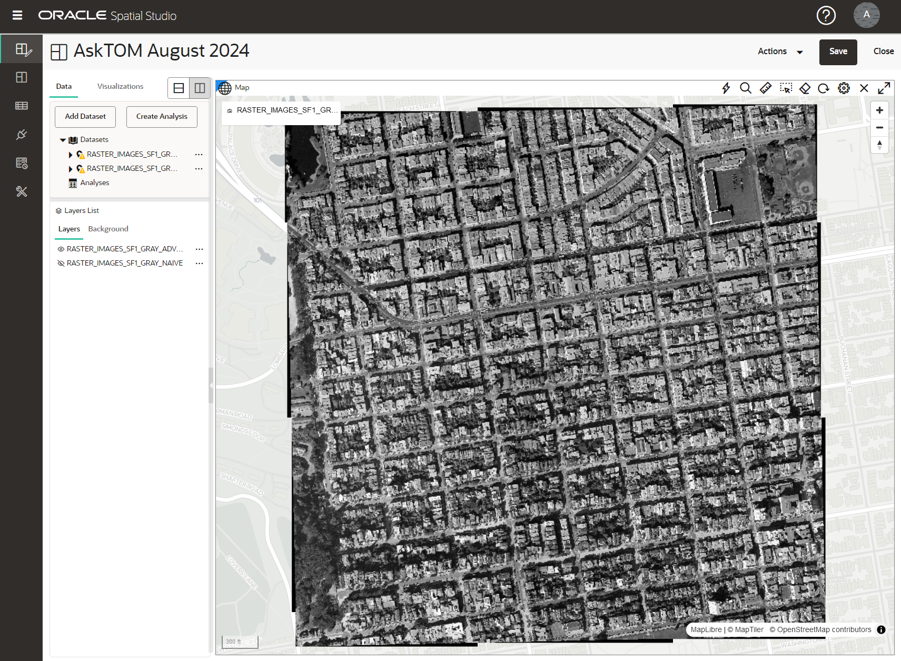
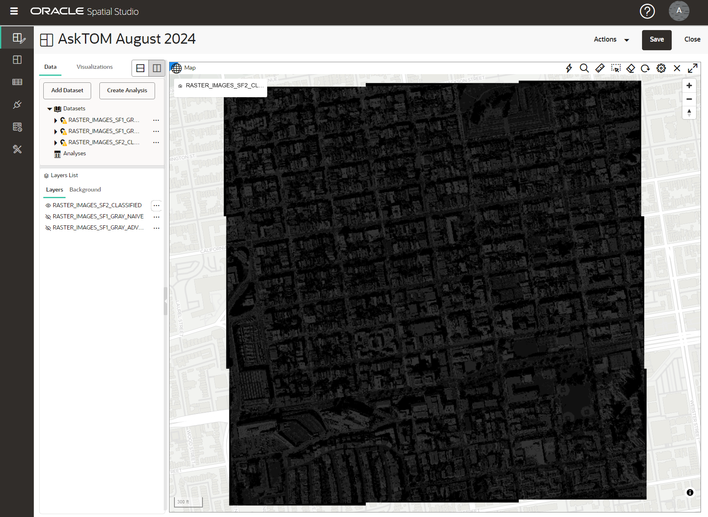
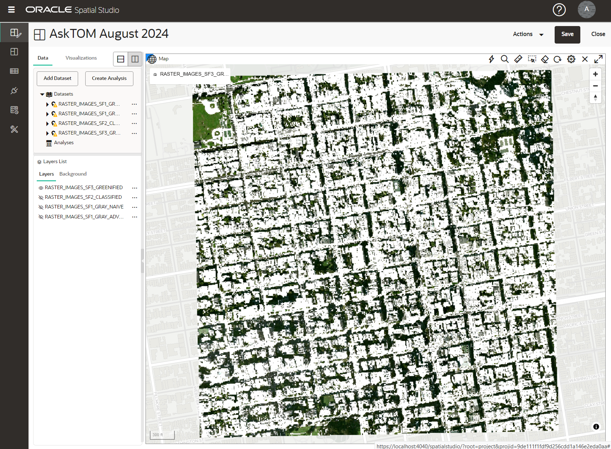

# Use Raster Algebra

`Raster Algebra` is commonly used in raster data analysis and GIS modeling. In GeoRaster, `Raster Algebra` is supported by the GeoRaster Raster Algebra language, which is an extension to `PL/SQL`, and a set of `Raster Algebra` functions for raster layer operations.

The `Raster Algebra` expression language includes general arithmetic, casting, logical, and relational operators and allows any combination of them. The `Raster Algebra` functions enable the usage of the expressions and support cell value-based conditional queries, mathematical modeling, classify operations, and cell value-based updates or edits over one or many raster layers from one or many GeoRaster objects.

GeoRaster supports `Raster Algebra` local operations, so the `Raster Algebra` operations work on individual raster cells, or pixels.

## Examples

Next, we use the `Raster Algebra` support of the Oracle Database available via the `PL/SQL` package `SDO_GEOR_RA` to perform several operations.

### Convert RGB to gray-scale images

   We start with converting the rasters, which are `RGB` images, to gray-scale images.

   ```sql
   /*
    * SDO_GEOR_RA.rasterMathOp example
    * Transform a set of RGB images into gray scale images.
    * Create a copy of the four rasters in RASTER_IMAGES, taking the average of the three RED, GREEN and BLUE pixel values (naive way).
    * This operation produces single-band rasters.
    */
   declare
      v_georid number;
      gr1   sdo_georaster;
      gr2   sdo_georaster;
   begin
      -- Clean up
      delete from raster_images where georid > 1000 and georid < 2000;

      -- Process all rasters in sequence
      for r in (
         select *
         from raster_images_mosaic
         order by georid
      )
      loop
         -- Get input raster
         gr1 := r.georaster;

         -- Define new GEORID
         v_georid := r.georid + 1000;

         -- Initialize output raster
         insert into raster_images (
            georid,
            georaster,
            source_file )
         values (
            v_georid,
            sdo_geor.init('raster_images_rdt_01'),
            r.source_file || ' converted to gray-scale')
         return georaster into gr2;

         -- Perform change
         sdo_geor_ra.rasterMathOp (
            inGeoraster   => gr1,
            operation     => sdo_string2_array('({0}+{1}+{2})/3'),  -- naive method
            -- operation     => sdo_string2_array('0.3*{0}+0.6*{1}+0.1*{2}'),  -- a better approximation
            outGeoraster  => gr2,
            storageParam  => null
         );

         -- Save result to database
         update raster_images
         set georaster = gr2
         where georid = v_georid;

         commit;
      end loop;
   end;
   /
   ```

   The result of the operation you can see in the following image:

   

   If you choose as `operation` the better approximation using the formula  `'0.3*{0}+0.6*{1}+0.1*{2}'` then you get a slightly different image. The differences in the gray scales you can see better when zooming into the image.

   

### Classify rasters

   Now, we classify the rasters in categories.

   ```sql
   /*
    * SDO_GEOR_RA.classify example
    * Take the average of the RED/GREEN/BLUE pixels, and classify them in four categories.
    * The output raster is a single band raster, with a cell depth of 4 bits.

      Input value   Output value
      -----------   ------------
      0 to  63                 0
      64 to 127                1
      128 to 191               2
      192 to 255               3
    */

   declare
      v_georid number;
      gr1   sdo_georaster;
      gr2   sdo_georaster;
   begin
      -- clean up
      delete from raster_images where georid > 2000 and georid < 3000;

      -- Process all rasters in sequence
      for r in (
         select *
         from raster_images_mosaic
         order by georid
      )
      loop
         -- Get input raster
         gr1 := r.georaster;

         -- Define new GEORID
         v_georid := r.georid + 2000;

         -- Initialize output raster
         insert into raster_images (
            georid,
            georaster,
            source_file )
         values (
            v_georid,
            sdo_geor.init('raster_images_rdt_01'),
            r.source_file || ' classified')
         return georaster into gr2;

         -- Perform classification
         sdo_geor_ra.classify (
            inGeoraster     => gr1,
            expression      => '({0}+{1}+{2})/3',
            rangearray      => sdo_number_array(63,127,191),
            valuearray      => sdo_number_array(0,1,2,3),
            outGeoraster    => gr2,
            storageParam    => 'cellDepth=4BIT'
         );

         -- Save result to database
         update raster_images
         set georaster = gr2
         where georid = v_georid;
         commit;

      end loop;
   end;
   /
   ```

   The result of this operation you can see in the following image:

   

### Find cell values

   Extract pixels from the rasters based on their values.

   ```sql
   /*
   * SDO_GEOR_RA.findCells example
   * Extract green pixels from a set of orthophotos
   * Create a copy of the four rasters in RASTER_IMAGES, only retaining the green pixels.
   * The green pixels are defined as those having a GREEN value larger than the RED or BLUE
   values.
   */

   declare
      v_georid number;
      gr1   sdo_georaster;
      gr2   sdo_georaster;
   begin
      -- Clean up
      delete from raster_images where georid > 3000 and georid < 4000;

      -- Process all rasters in sequence
      for r in (
         select * from raster_images where georid in (1,2,3,4)
      )
      loop
         -- Get input raster
         gr1 := r.georaster;

         -- Define new GEORID
         v_georid := r.georid + 3000;

         -- Initialize output raster
         insert into raster_images (
            georid,
            georaster,
            source_file )
         values (
            v_georid,
            sdo_geor.init('raster_images_rdt_01'),
            r.source_file || ' greenified')
         return georaster into gr2;

         -- Select cells
         sdo_geor_ra.findCells (
            inGeoraster   => gr1,
            condition     => '{1}>={0}&{1}>={2}',
            storageParam  => null,
            outGeoraster  => gr2,
            bgValues      => sdo_number_array (255,255,255)
         );

         -- Save result to database
         update raster_images
         set georaster = gr2
         where georid = v_georid;
         commit;

      end loop;
   end;
   /
   ```

   The result of the operation you can see in the following image:

   
